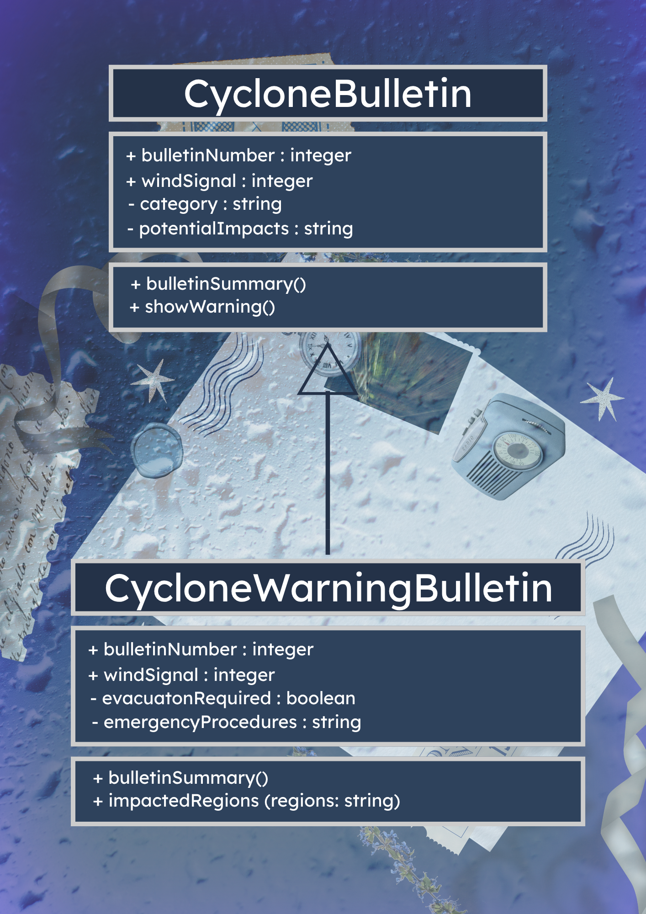
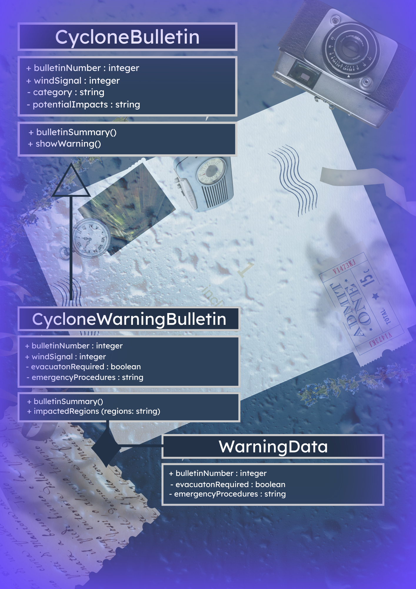
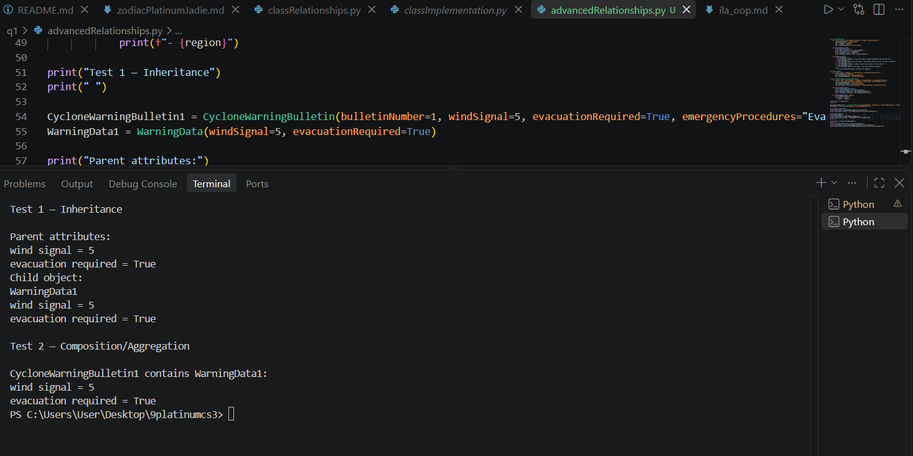
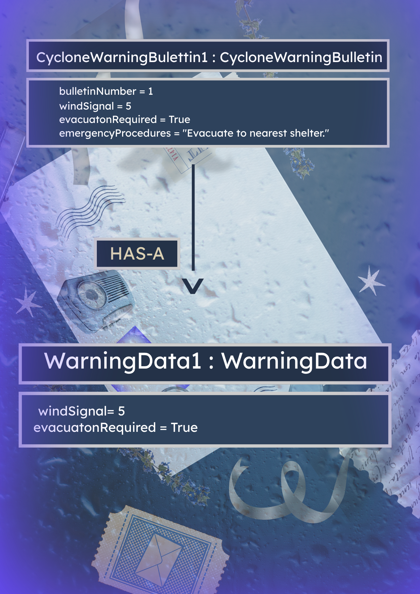

# Advanced Class Relationships

## Previous Activities
[classAttributeMethods](classAttributesMethods.md)

[classRelationships](classRelationships.md)

## Existing System Description:

## Inheritance Relationship
Parent: CycloneBulletin

Child: CycloneWarningBulletin

Explanation: The term "cyclone bulletins" is generalized as there are many types of bulletins when issued at a different time. A cyclone warning bulletin is implemented when a storm is epected to hit landfall in less than 24 hours. So it is considered a child class from the CycloneBulletin parent class.

## Inheritance UML

## Composition/Aggregation
Relationship: The realationship im using is Composition (Strong HAS-A relationship)

Explanation: Because a CycloneWarningBulletin needs to own its specific alert details, such as the emergency instructions, and wind signals are created for that specific warning. If you delete the warning bulletin, the specific emergency proceudres should be deleted aswell.

## Advanced UML Diagram

## Python Implementation
[Source Code](advancedRelationships.py)

## Test Run

## Object Diagram

## Reflection
Answers:
