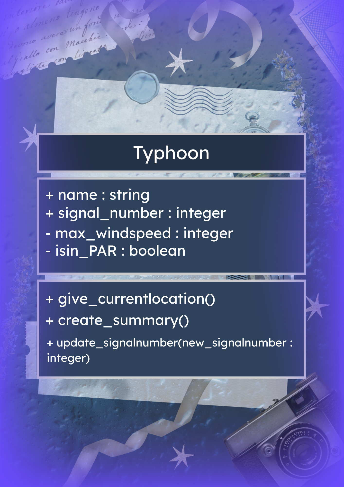
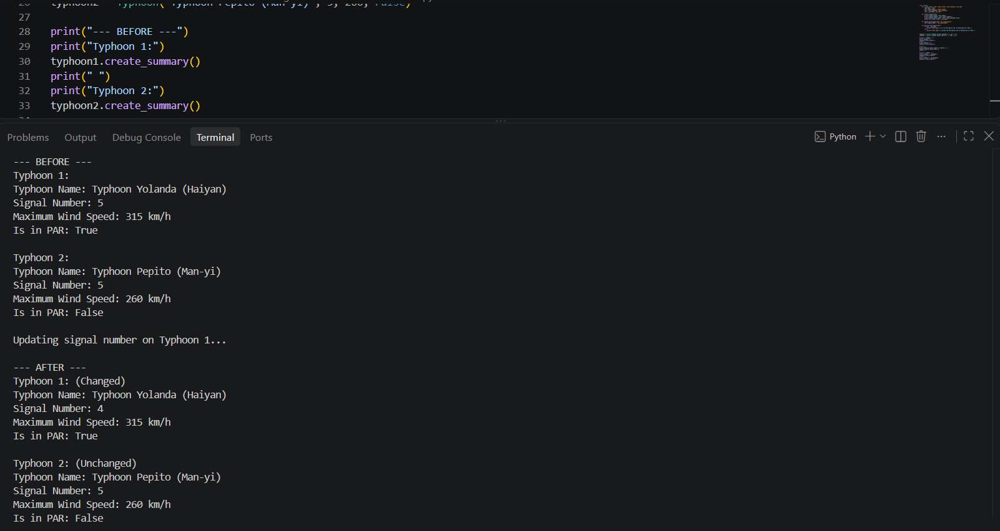
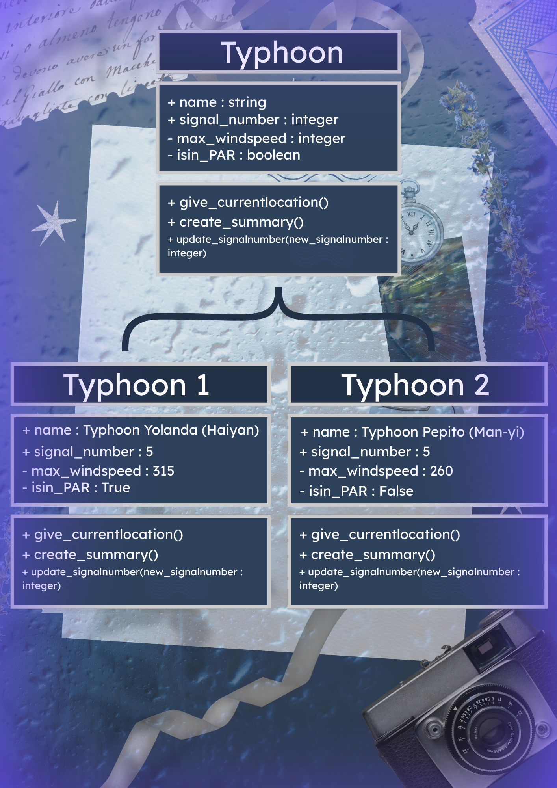

# Class Attributes and Methods
## Previous Design

Link to my previous activity:
[classObjectUML.md](classObjectUML.md)

## Design Revision
No major changes were needed from my original design.

## Visibility Decisions
| Attribute | Data Type | Visibility | Reason |
|---|---|---|---|
| name | string | public | For general identification |
| signal_number | integer | public | For general information to the public |
| max_windspeed | integer | private | To prevent tampering of windspeed |
| isin_PAR | boolean | private | To prevent tampering and becoming wrong |

## Updated UML Class Diagram

## Python Implementation
[View Python Source](classImplementation.py)

## Test Run

## Object Diagram

## Analysis
### Why did you make your chosen attribute private?
- I made it private because it can't be changed incorrectly and spread misinformation.

### Which method changes the state of your object?
- The method that changes the state of my object is update_signalnumber().

### How did your two objects demonstrate that instances are independent?
- It shows that instances are independent because when I changed the state of something in object 1, the second object's state didn't change at all.

### What is the difference between your class diagram and your object diagram?
- The class diagram is basically the blueprint of an object made from that class template and the object diagram shows 2 objects made from that class template.
