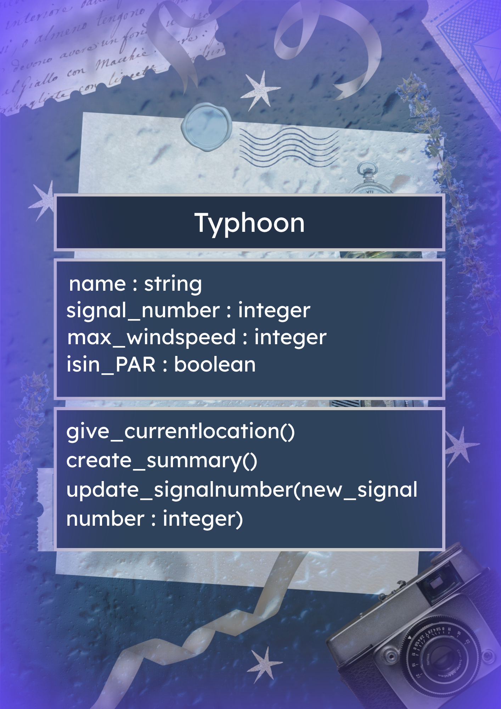

# SG4 - Understanding Classes and Objects
## Class Name
- Typhoon
## Class Description
- This class represents tracking a typhoon with its location, signal number, windspeed and more.
## Properties
| Property | Data Type | Description |
|---|---|---|
| name | string | Name of the typhoon |
| signal_number | integer | How strong the wind of the typhoon is when it arrives |
| max_windspeed | integer | The maximum wind speed of the typhoon (km/h) | 
| isin_PAR | boolean | Indicates whether the typhoon is inside the Philippine Area of Responsibility | 

## Methods
| Method | Description |
|---|---|
| give_currentlocation()‎ | Gives the current location of the typhoon |
| create_summary() | Creates a text report of the typhoons properties (name, signal no., wind speed) |
| update_signalnumber(new_signalnumber: integer) | Updates the signal number of the typhoon. |

## Class Diagram

## Design Explanation
### Why did you choose this class?
- I chose this class because I wanted to do something interesting and thought of meteorology, and then I thought of typhoons and the PAGASA Tropical Cyclone Bulletin.
### Which property is the most important? Why?
- I think the property that is the most important is the signal_number because it tells us how strong the typhoon is, which helps us know the safety measures we should take and how prepared we should be for the typhoon.
### Which method is the most useful? Why?
- I think its give_currentlocation because it lets us know where the typhoon is, and tells us what places are affected by this.
