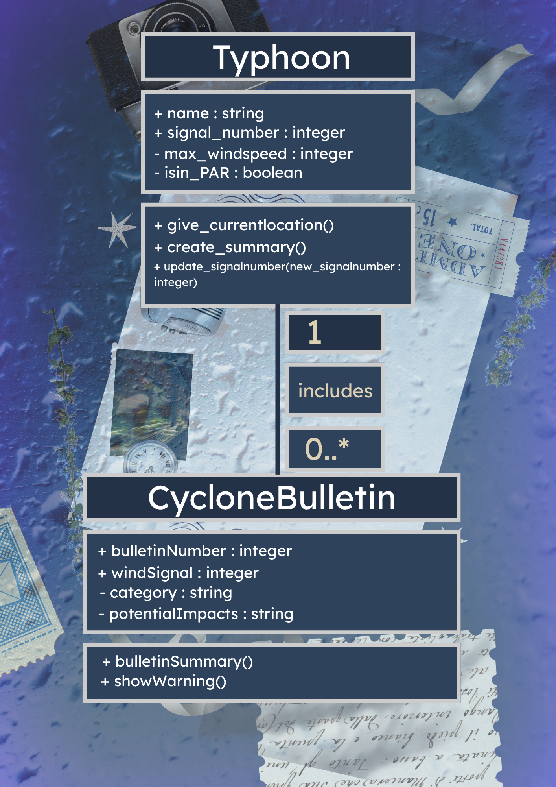
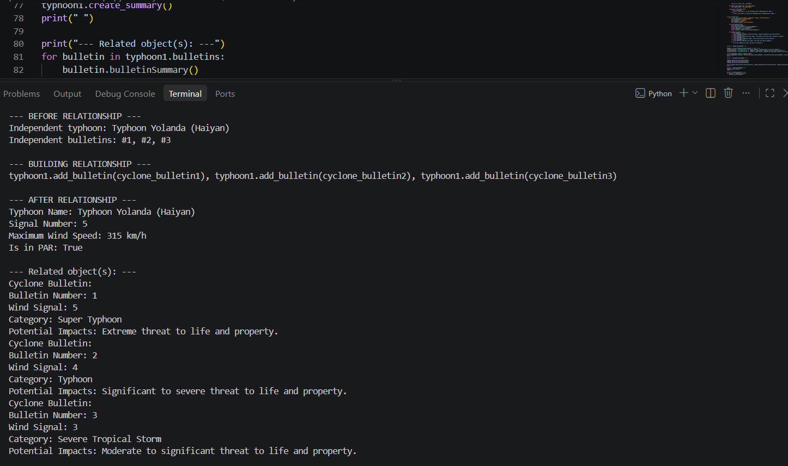
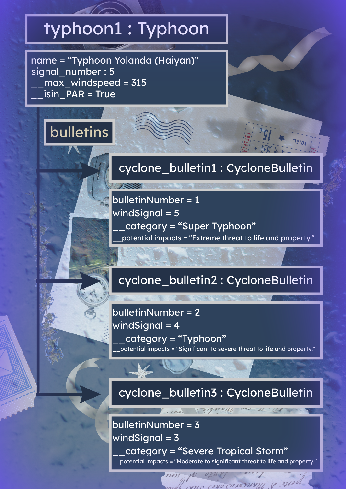

# Class Relationships: Association and Multiplicity
## Previous Work

[Part I - Classes and Objects](classObjectUML.md)
[Part II - Class Attributes and Methods](classAttributesMethods.md)

## Existing Class
Class: Typhoon
Description: This class represents tracking a typhoon with its location, signal number, windspeed and more.

## New Related Class
Class: CycloneBulletin
Description: This class represents showing the different levels of a typhoon/cyclone and showing a warning system in each level.

## Association
Relationship: A typhoon includes a dedicated cyclone bulletin
Explanation: A cyclone bulletin shows the strength of it and shows the necessary precautions we must do when hit by this typhooon/tropical storm so it is a HAS-A relationship.

## Multiplicity

Multiplicity: 1..* (One or more)
Explanation: A tropical cyclone/typhoon can have multiple bulletins as the strength of it can vary over time. Moreover, having multiple bulletins rather than only udating one can show the history of the typhoon's strength and wind signal.

## UML Class Relationship Diagram

## Python Implementation
[View Python Source](classRelationships.py)

## Test Run

## Object Relationship Diagram

## Analysis
### What is the association between your two classes?
- 
### What multiplicity did you choose and why?
- 
### How did you implement the relationship in Python?
- 
### Why did you store an object reference instead of copying its data?
- 
### If your relationship uses many, why is a list appropriate?
- 
